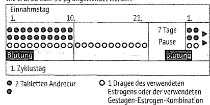

# 使用说明：患者信息

## Androcur® 50毫克片

### 醋酸环丙孕酮

__在开始使用这种药物之前，请仔细阅读整个药品说明书，因为它包含重要的信息__

- 请保留药品说明书。您可能希望以后再次阅读。
- 如果您有任何其他问题，请咨询您的医生或药剂师。
- 这种药物是根据您个人的处方开具的。不要将其转交给他人。即使这些人有与您相同的症状，它也可能会对其他人造成伤害。
- 如果您注意到任何副作用，请咨询您的医生或药剂师。这也适用于未在此药品说明书中提到的副作用。

## 在这份使用说明书中的信息：

1. 什么是 Androcur 50 mg 以及它用于什么？
2. 在服用 Androcur 50 mg 之前应注意什么？
3. 如何服用 Androcur 50 mg？
4. 可能会出现哪些副作用？   
5. 如何储存 Androcur 50 mg？
6. 包装的内容和其他信息

## 1. 什么是 Androcur 50 mg 以及它用于什么？

Androcur 50 mg 包含醋酸环丙孕酮作为活性成分。Androcur 50 mg 是一种抗雄激素药物。它抑制男性激素（雄激素）的作用，这些激素也会在女性体内产生，但数量较少。此外，它还具有孕激素和抗性腺激素的作用。

在男性患者治疗过程中，Androcur 50 mg 可减少性欲和性能力，并抑制生殖腺功能；这些变化在停药后会恢复。

Androcur 50 mg 可阻断从生殖腺和/或肾上腺皮质分泌的雄激素，从而保护雄激素依赖的靶器官，如前列腺。

在女性中，Androcur 50 mg 可减少异常增加的体毛，减少因雄激素导致的脱发，并减轻过度的皮脂分泌。治疗期间会抑制卵巢功能。

**在男性中**
Androcur 50 mg 用于：

- 减轻转移瘤或局部晚期不可手术的前列腺癌患者的症状，
  - 当使用 LHRH 类似物（可以减少睾丸内性激素的产生的物质）的治疗或手术方法被证明疗效不足或有禁忌症时，或者可以使用药物口服治疗时，应优先使用 Androcur 50 mg。
  - 作为开始 LHRH 激动剂治疗的一部分，以预防由初始睾丸素（雄性激素）水平的升高引起的不良反应和并发症。
  - 治疗使用 LHRH 激动剂或睾丸切除后出现的潮热。
- 对于因对性满足有过度需求（过度性欲）和病态性别倾向（性偏执）的患者进行性欲抑制。

（LHRH: 促性腺激素释放激素；LHRH 激动剂: 可以模拟 LHRH 作用的药物）

对于存在过度性欲（过度的性满足）和病态性别倾向（性偏执）的患者，只有在医生认为其他治疗措施不适用时，才应该使用 醋酸环丙孕酮 50 mg。

**在女性中**

Androcur 50 mg 用于严重至非常严重的雄激素化症状（由某些激素引起的男性化）如：

- 严重的雄激素引起的面部和身体多毛症（严重多毛症），
- 严重的雄激素引起的头发脱落（雄激素型脱发），常常与严重的痤疮和/或皮脂腺过度活跃相结合。

只有在低剂量的含醋酸环丙孕酮的药物或其他治疗措施没有达到满意的效果时，才应该使用 醋酸环丙孕酮 50 mg 来治疗严重至非常严重的雄激素化症状。

__警告和注意事项__

在使用 Androcur 50 mg 之前，请先与您的医生或药剂师进行咨询。

在下面的部分将说明在什么情况下您只能在特定条件下且只有在特别小心的情况下使用 Androcur 50 mg。请向您的医生咨询。即使这些信息以前适用于您，也应该遵循这些指示。

在晚期前列腺癌患者中，如果出现先前的血栓栓塞事件、严重的糖尿病伴随血管病变或镰状细胞贫血，医生必须在仔细权衡利弊后在个别情况下决定是否使用。

*脑部肿瘤*

使用 醋酸环丙孕酮 与通常良性的脑肿瘤（脑瘤）的发生有关。特别是在您长期（数年）使用 醋酸环丙孕酮 或在较短时间内使用高剂量（每天25毫克及以上）时，此风险会增加。如果发现您患有脑瘤，您的医生将停止使用 醋酸环丙孕酮（请参见“不得使用醋酸环丙孕酮”一节）。如果您发现以下症状，请立即通知您的医生：视力障碍（例如复视或模糊视觉）、听力丧失或耳鸣、嗅觉丧失、头痛日益加重、记忆力丧失、癫痫发作、手脚无力感。

有报告称，服用 Androcur 50 mg 的患者有发生血栓栓塞事件（血管被血栓阻塞）。对于先前有过动脉或静脉血栓性/血栓栓塞性事件（例如深静脉血栓、肺栓塞、心肌梗死）、先前的脑血管事件（中风）或晚期恶性肿瘤的患者，进一步发生血栓栓塞事件的风险增加。

如果您患有糖尿病，请告知您的医生，因为可能需要调整您的糖尿病药物剂量。因此，在使用Androcur时，应仔细监测糖尿病（另请参见第2节“不得使用Androcur 50 mg治疗男性的“性过度和性倾向障碍”，也不得使用Androcur 50 mg治疗女性的“严重至极严重的雄激素过多症状”（“某些激素导致的男性化”参见第1节））。

在治疗期间，应定期监测肝功能和肾上腺皮质功能。治疗开始前应测定肝功能检测值。

如果您感到腹部非常不舒服，而且疼痛不会自行消失，请立即告知您的医生。这些疼痛可能是良性或恶性肝肿瘤的迹象，可导致危及生命的腹腔出血。

在男性治疗期间，应定期检查红细胞计数。

在使用Androcur 50 mg进行性欲抑制时，同时饮酒可能会降低其性欲抑制效果，因为酒精具有降低心里抑制的作用。

在女性开始治疗之前，必须进行彻底的妇科检查（包括乳房检查和子宫颈细胞学刮片），并在绝对排除怀孕。

在育龄妇女中使用Androcur 50 mg时，应与适当的雌激素或适当的孕激素雌激素联合使用，以避免周期紊乱并确保避孕。

在女性严重的雄激素化症状联合治疗中，必须注意所使用的雌激素或孕激素雌激素联合制剂说明书中所列的禁忌症和停药原因。

如果在联合治疗期间出现轻度的“月经期外”出血，在三个服药周期内不应中断使用，但如果出现任何较严重的出血，您应咨询医生。

男性的性欲增强不一定是由于雄性激素（雄激素活性）的产生增加，因此抑制雄激素活性并不总是与抑制性欲有关。通常需要采取精神病学、心理治疗和社会治疗措施。

## 2. 您在服用 Androcur 50 mg 之前需要注意什么？

**Androcur 50 mg 不能用于治疗男性的“性冲动抑制和性倾向异常”，如果符合下列条件：**
- 您对 醋酸环丙孕酮 或本药品中列出的任何其他成分过敏，
- 患有肝病，
- 患有 Dubin-Johnson 综合征（黑肝综合征）和 Rotor 综合征（遗传性肝功能障碍，其中红色血细胞颜色素胆红素的排泄受到影响），
- 曾有或目前存在肝肿瘤，
- 已知或疑似患有恶性疾病，
- 您被发现患有脑瘤（通常是一种良性的脑肿瘤）。如果您对此不确定，请咨询您的医生。
- 患有严重的慢性抑郁症，
- 曾经或目前有血栓栓塞病史（通过在血管中形成血块影响血液循环的疾病），
- 患有严重的糖尿病（伴随血管病变），
- 患有镰刀细胞贫血，
- *青少年在青春期结束之前和儿童不能使用，因为可能会对发育中的内分泌系统和（或）身高产生不利影响。*

**男性在进行“晚期前列腺癌的缓解治疗”期间不得使用Androcur 50 mg，如果符合以下条件：**

- 您对醋酸环丙孕酮或本药的6节中提到的任何其他成分过敏，
- 您有肝病，
- 您患有Dubin-Johnson综合症和Rotor综合症（遗传性肝功能障碍，其中红血球颜色素胆红素的排泄受到影响），
- 您曾有或正在经历肝肿瘤（仅当这些肿瘤不是前列腺癌转移病变引起的），
- 您已知或疑有恶性肿瘤（除了晚期前列腺癌），
- 如果您被确诊为脑瘤（通常是良性的脑肿瘤）。如果您对此不确定，请咨询您的医生。
- 您患有严重的慢性抑郁症，
- 您存在血栓栓塞症（通过在血管中形成血栓影响血液循环），
- *对于未成年人在青春期结束前和儿童，因为对发育中的内分泌功能和/或生长有不利影响，因此不能排除不良影响。*

**在治疗 “严重到非常严重的雄性化改变“ （例如因激素失衡而表现为男性化特征，参见第1节）时不得服用Androcur 50 mg，如果符合以下条件：**

- 如果您对环丙孕酮或本药其他成分（见第6节）过敏，
- 在怀孕期间，
- 在哺乳期间，
- 当阴道出血原因未明时，
- 在患有肝病时，
- 在患有Dubin-Johnson综合症和Rotor综合症（这是遗传性肝功能障碍，影响了红细胞中的胆红素排泄）时，
- 如果您在早期的妊娠中曾出现黄疸，持续的瘙痒或疱疹（孕期疱疹），
- 在患有先前或现有的肝肿瘤时（仅当这些不是由前列腺癌的子宫内膜转移引起时），
- 在已知或疑有恶性肿瘤时（除晚期前列腺癌外），
- 如果您被诊断出脑瘤（通常是一种良性的脑瘤）。如果您对此有任何疑问，请咨询医生。
- 在患有严重的慢性抑郁症时，
- 在先前或现有的血栓栓塞事件（通过在血管中形成血栓来影响血液循环）时，
- 在患有严重糖尿病（糖尿病）伴随血管变化时，
- 在患有镰状细胞贫血时，
- *在青春期结束前和儿童中，因为可能会对发育中的内分泌功能和（或）身高发育产生不利影响，所以不允许使用。*

患有器质性脑损伤或心理疾病并表现出行为异常的患者通常不会对治疗产生反应。

对于可能存在的生育障碍（生殖障碍），建议在治疗开始前进行精液分析。

**儿童和青少年**

Androcur 50 mg不应用于18岁以下的男性儿童和青少年，因为该年龄组缺乏有关其疗效和耐受性的数据。

Androcur 50 mg在18岁以下的女性儿童和青少年的安全性和有效性尚未得到研究。

不应在青春期结束前使用Androcur 50 mg，因为它可能会对身高（长度生长）产生不利影响。

**其他药物同时使用Androcur 5O mg**

如果您正在使用其他药物，最近使用过其他药物或打算使用其他药物，应该告知医生或药剂师。

特别是对于属于他汀类药物（用于降低血脂水平的药物，例如胆固醇或甘油三酯）的药物，因为它们可能会影响体内醋酸环丙孕酮的药物浓度。当与高剂量的醋酸环丙孕酮一起使用时，他们可能会共同作用于相同的代谢途径，从而增加他汀类药物对肌肉组织（称为肌肉或横纹肌溶解症）的副作用风险。

如果您正在服用其他药物，请告知您的医生，例如肯头唑、伊曲康唑、克霉唑（用于治疗真菌感染）、利托那韦（用于治疗HIV感染）、利福平（用于治疗结核病）、苯妥英（用于治疗癫痫）和含有金丝桃的产品。

**怀孕和哺乳期**

如果您怀孕或正在哺乳，或者您怀疑自己已经怀孕或打算怀孕，在服用此药物之前，请咨询医生或药剂师的意见。

在开始治疗之前，必须进行彻底的妇科检查；对于有生育能力的患者，必须排除怀孕。

在怀孕期和哺乳期，或者在先前的怀孕期出现黄疸，持续性瘙痒或水疱性皮疹（妊娠疱疹），不得使用 Androcur 50 mg。

**驾驶和操作机器的能力**

Androcur 50 mg 可能导致疲劳和精力下降，并影响注意力。即使在正常使用时，Androcur 50mg 也会导致驾驶能力和操作机器的能力受到限制。因此，您不能驾驶机动车辆、操作机器或从事其他危险性活动。

Androcur 50 mg 含有乳糖。因此，如果您知道自己对某些糖不耐受，请在咨询医生后再服用 Androcur 50 mg。

## 3. Androcur 50 mg 应该怎么服用？
请在医生的指导下严格按照药品说明服用。如果您不确定，请向您的医生或药剂师咨询。

Androcur 50 mg是一种口服片剂。请在饭后用足够的水（优选是一杯饮用水[200毫升]）整片吞服，不要咀嚼。

除非医生另有指示，否则常规剂量为：

**男性使用**

*治疗性欲亢进和病理性性欲（性欲错乱）的性欲抑制*

治疗期应根据个体情况确定。治疗效果有时可能在几周内见效，但有时也可能需要几个月的时间才能观察到治疗效果。

通常需要采取精神病学和心理治疗措施。在采取这些措施时，使用醋酸环丙孕酮治疗可能有助于抑制性欲。

剂量由医生决定。通常的初始剂量为每天2次1片。可能需要将剂量增加到每天2次2片，甚至是暂时每天3次2片。在达到满意的治疗效果后，会尝试用尽可能小的剂量维持治疗效果。通常每天2次半片就足够了。调整到维持剂量和停药时，从来不是突然停药，而是逐步减少剂量。在适当的间隔时间内，每几周可以减少1片或更少的片剂，以稳定治疗效果。为了稳定治疗效果，如果可能，需要长期服用安络师50毫克，并同时采取心理治疗措施。

*抗雄激素治疗前列腺癌*

对于有癌症晚期转移或局部晚期、不能手术的前列腺癌患者的缓解治疗：

每天服用2-3次2片剂。医生开的剂量不应该在病情改善或缓解后减少或停止服用。

为预防因LHRH激动剂治疗刚开始时男性性激素水平的暂时升高而引起的不良反应和并发症：

首先，连续5-7天每天单独服用2次2片剂，然后再连续3-4周每天与LHRH激动剂按厂家建议的剂量一起服用2次2片剂。在LHRH激动剂治疗中应遵循所使用制剂的使用说明。

治疗因LHRH类似物治疗或去除睾丸组织后出现的潮热：
建议每天服用1-3片剂，如果需要，可增加至每天3次服用2片剂。

**女性使用：**

必须严格遵循医生开的治疗方案。

对于具有生育能力且月经规律的女性，治疗应该从月经的第一天（即周期的第1天）开始。从第1天到第10天，每天服用2片剂，最好在同一时间服用，如果医生没有另外指示的话。

此外，在第1到第21天为了稳定周期和必要的避孕措施，每天还需要使用适当的雌激素或雌孕激素联合剂，其乙烯雌酚含量尽可能低，如30或35微克。

示例图 ：

图例： 
- 深黑色圆圈 = 2粒Androcur
- 透明圆圈 = 1粒雌二醇 或者 使用中的 雌二醇+孕酮复合剂
- Blutung = 月经
- 1 Zyklustag = 周期第一天
- 7 Tage Pause = 停用7天  

该治疗开始21天后会有一个为期7天的停药期，在此期间会出现一次月经。在这个停药期后，无论月经是否已结束，都要以相同的方式重新开始服药。如果在停药期间没有出现月经，则暂时不应继续服药，并需要就医排除妊娠。

如果在三周的服药期间发生轻度异常月经，不应中断使用。但是，如果出现持续或反复发作的不规则月经，则也需要就医。此外，在必要的情况下使用适当的雌激素或雌孕激素联合剂时，需要遵守适用于该制剂的所有说明。

月经失调改善后，医生可以在联合治疗的前10天将每日服用的Androcur 50 mg 剂量降至1片或1/2片，或者继续使用Androcur 10 mg片进行联合治疗。有时候仅使用抗雄激素有效的孕激素-雌激素联合剂即可。

*对于具有不规则或无月经的生育年龄妇女*

如果排除了怀孕的可能性，则可以立即开始治疗。与具有规律月经的生育年龄妇女不同，从治疗的第一天起没有安全的避孕保护。

在口服避孕药（“短效避孕药”）每日使用的前14天内，还必须使用其他避孕方法（例如安全套）。第一天治疗被视为第一天周期。进一步的治疗与具有规律月经的妇女一样进行。在停药期间，可能会出现一次中断性月经。

已经绝经或已切除子宫的女性可以单独使用Androcur 50 mg。根据症状的严重程度，剂量为每日1/2 -1片，遵循21天服药和7天停药的方案。

女性应该在规定的时间服用联合治疗药物。如果这个时间超过12个小时，那么该周期的避孕效果将受到质疑。

您的医生将在更年期开始时重新评估您的治疗利益和风险。应避免长期（多年）使用Androcur 50 mg进行治疗（参见“警告和注意事项”下的第2节）。

**特定患者群体的补充信息**

*儿童和青少年的应用*

不应将Androcur 50毫克用于18岁以下的男童和青少年。男性和女性患者只能在青春期结束后使用Androcur 50 mg。在青春期结束之前，无法完全排除Androcur 50毫克对身高（长度生长）的不良影响。

*老年患者（65岁或以上）*

在老年患者中未进行Androcur 50 mg的药代动力学研究（吸收，分布，代谢和排泄）。

*肝功能受损的患者*

如果您患有肝脏疾病，请勿服用Androcur 50毫克（也请参阅第2节）。

*肾功能受损的患者*

未对肾功能受损的患者进行Androcur 50 mg的药代动力学研究（吸收，分布，代谢和排泄）。如果您认为Androcur 50 mg的效果过于强或过于弱，请与您的医生或药剂师联系。

**如果您服用了比应服用的Androcur 50毫克更多的药物**

没有迹象表明Androcur 50 mg 过量会造成严重的健康危害。

**如果您忘记服用Androcur 50毫克**

*对于女性*

如果有怀孕的可能性存在或停药时间较长，只有在排除怀孕的情况下才能再次开始治疗。忘记服用 Androcur 50 mg可能会导致药效减少和阴道出血。

如果您忘记服用药物，请仍然按照规定继续服用联合疗法，跳过忘记的药片和/或超时服用的药片，以避免早期阴道出血。您不应该服用双倍剂量的 Androcur 50 mg来弥补漏服的药片。然后按照惯例进行 7 天的服药间歇期，期间会发生阴道出血。如果没有阴道出血，则不应继续治疗，而应咨询医生。应注意使用的雌激素或孕激素-雌激素联合用药的使用说明中的提示和建议（特别是关于避孕措施的可靠性和忘记服药的建议）。

*对于男性*

如果您忘记服用药物，请仍然按照规定继续治疗，跳过忘记的药片，不应服用双倍剂量的 Androcur 50 mg 来弥补漏服的药片。

**如果您停止服用 Androcur 50 mg**

您最初由医生开具 Androcur 50 mg 用于治疗的症状可能会再次出现。如果您打算中断或提前结束服用 Androcur 50 mg 的治疗，请与您的医生商讨。

如果您对服用此药物有任何疑问，请咨询您的医生或药剂师。

## 4. 什么是可能的副作用？

像所有药物一样，这种药物也可能会产生副作用，但并不一定会发生在每个人身上。
在副作用的发生率方面，以下分类将被应用：

- 非常常见：可能会影响10个治疗者中的1个以上
- 常见 （经常）：可能会影响10个治疗者中的1个
- 偶尔：可能会影响100个治疗者中的1个
- 罕见：可能会影响1,000个治疗者中的1个
- 非常罕见：可能会影响10,000个治疗者中的1个
- 未知：基于可用数据，无法估计发生频率

**可能的副作用**

*男性*

服用Androcur 50mg的患者中，最常见的副作用是性欲降低、勃起障碍和精子形成的抑制。

*女性*

Androcur 50 mg对女性患者最常见的副作用包括阴道出血、体重增加和情绪低落。

*男性和女性*

最严重的副作用涉及肝脏毒性反应（如黄疸、肝炎和肝功能衰竭）、良性和恶性肝肿瘤（可导致腹腔出血）以及血管阻塞（血栓栓塞事件）。

除此之外，还有报告了与Androcur 50 mg相关的以下副作用，按人体器官系统分类列出：

*检查相关：* 偶尔会出现垂体素（一种人体激素）轻微升高，非常罕见的是体内皮质醇（一种激素）减少。

*血液和淋巴系统疾病*：男性患者出现贫血（缺铁性贫血）（发生率不明）。

*呼吸系统、胸腔和横膜疾病：*Androcur 50 mg可能导致呼吸急促感（男性常见；女性发生率未知）。

*皮肤和皮下组织疾病：*男性偶尔出现皮疹，女性发生率未知。由于皮脂腺分泌减少，可能导致皮肤干燥，发生率未知。

*骨骼肌、结缔组织和骨骼疾病：* Androcur 50 mg的长期使用可能导致男性骨质疏松症（发生率不明）。

*代谢和营养紊乱：* 男性体重增加或减少常见；女性发生率不明。糖尿病患者可能出现血糖升高，发生率不明。

*血管疾病：* 血栓栓塞事件（血管阻塞），发生率不明。

*一般性疾病和治疗部位反应：* 男性经常感到疲劳；女性发生率不明。男性经常出现潮热和出汗。

*免疫系统疾病：* 男性偶尔会出现过敏反应，女性发生率不明。

*肝脏和胆囊系统疾病*

Androcur治疗期间应定期检查肝功能。已经报道了男性患者在使用Androcur治疗期间出现黄疸、肝炎（肝脏炎症）和肝衰竭等肝损伤。在100mg 及以上的剂量下，也报道了致命的情况。在大多数报告的致命情况中，患者均为晚期前列腺癌患者。损害与剂量有关，并且通常在治疗开始数月后发展。在治疗开始前，治疗过程中定期检查肝功能，并在出现疑似肝损伤的症状或体征时检查肝功能。如果肝损伤的怀疑得到证实，则应停止使用Androcur 50mg（男性和女性），除非肝损伤是由其他原因（例如转移瘤）引起的（男性）。在这种情况下，只有在预期的好处大于风险时，才应继续使用Androcur 50mg治疗。

对于女性而言，尚不清楚肝损伤（肝毒性）反应（如黄疸、肝炎、肝衰竭）的发生率。

在使用Androcur 50mg期间，已经观察到了良性或恶性肝肿瘤。在男性中，肝癌非常罕见，对于女性则无法确定发生率。

对于男性和女性而言，在使用剂量为每天25毫克及以上的Androcur 50 mg数年后，已经报告了脑瘤的发生（通常是脑的良性肿瘤）（请参见第2节）（发生率：罕见）。

Androcur 50mg会逐渐降低男性的生育能力。在数周的治疗中，精子的发育（精子生成）往往会受到抑制。精液量也会减少。治疗结束后数月内，生育能力会恢复。Androcur 50mg会导致男性患者乳房肿胀（乳腺增生），并且常常伴有敏感性增加。这些变化通常在治疗结束后会消退。

在女性的联合治疗期间，卵巢的排卵被阻止。另外，已报道过乳房紧涨感和乳房增大（频率不明）。阴道滴血、不规则妇科出血和闭经（月经不来）的发生率未知。在联合治疗中，应注意使用雌激素或孕激素-雌激素联合剂的使用说明中的副作用提示。

精神疾病方面，男性非常容易出现性欲降低和阳痿。这些症状在停药后会消失。女性可能出现性欲减退，但也可能出现性欲亢进（频率不明）。男性常常出现暂时的内心不安、抑郁情绪以及动力降低，这可能会影响注意力。需要集中注意力的患者（如开车、操作机器等）必须注意。抑郁情绪和暂时的内心不安也会发生在女性身上，但发生率未知。

在男性和女性身上都观察到了腹腔内出血（发生率未知）。

与含有醋酸环丙孕酮作为活性成分的药物相关的药物中，女性主要报告了胃部不适、头晕、头痛和恶心。

**报告副作用**

如果您发现副作用，请与您的医生或药剂师联系。这也适用于未在此包装说明中列出的副作用。您也可以直接向德国药品和医疗器械联邦机构 (Bundesinstitut fuer Arzneimittel und Medizinprodukte)，Pharmakovigilanz，Kurt-Georg-Kiesinger-Allee 3，D-53175 Bonn，网站：http://www.bfarm.de 报告副作用。通过您报告的副作用，您可以为提供更多关于该药品安全性的信息做出贡献。

## 5. 如何存储Androcur 50 mg？

请将此药品放在儿童无法接触的地方。不得在纸盒上标有的“使用期至”日期之后使用本药品。保质期指所示月份的最后一天。
此药品无需特殊储存条件。

## 6. 包装内的内容物和其他信息

**Androcur 50 mg包含的成分**
- 活性成分：醋酸环丙孕酮

  1片包含50 mg环丙孕酮醋酸盐。
  
- 其他成分：乳糖一水合物、玉米淀粉、聚乙烯吡咯烷酮K25、高分散二氧化硅和硬脂酸镁（Ph.Eur.）。

**Androcur 50 mg的外观和包装**

Androcur 50 mg是白色至淡黄色的药片，一面有断裂线，另一面有“BV”字样的六边形凸起。这个药片可以平分为两半。

Androcur 50 mg有20片、50片和100片的包装。
再次可能没有列出全部包装尺寸。

**制药商**

Jenapharm GmbH＆Co. KG

Otto-Schott-Straße 15

07745 Jena

电话：03641- 87 97 444

传真：03641- 87 97 49 444

电子邮件：kundenservice@jenapharm.de

**制造商**

Bayer Weimar GmbH & Co.KG
Döbereinerstraße 20
99427 Weimar
Deutschland

拜耳股份公司
51368 Leverkusen
德国

本包装说明最近更新于2022年1月。

特别提示：
有关药品的更详细信息，需要面向医生的制定的印刷品。
